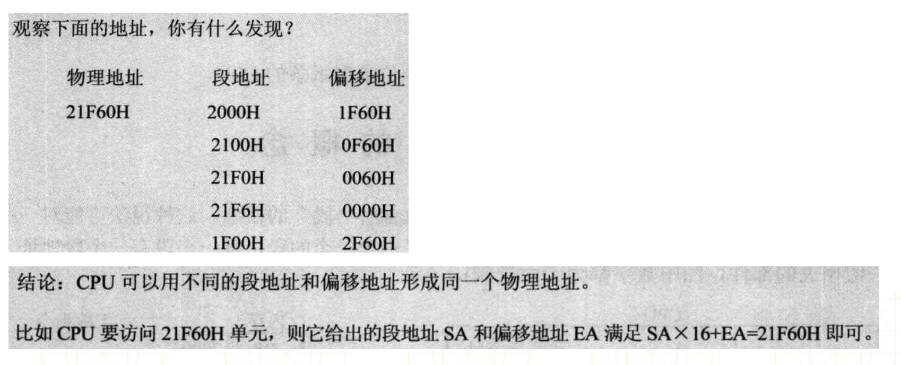

# 汇编语言
## 基础
### 编程语言
* 机器语言
    * 由0和1组成
* 汇编语言（Assembly Language）
    * 用符号代替了0和1，比机器语言便于阅读和记忆
* 高级语言
    * C\C++\Java\Swift等，更接近人类自然语言
    
比如操作：将寄存器BX的内容送入寄存器AX
机器语言：1000100111011000
汇编语言：mov ax, bx
高级语言：ax = bx;


* 汇编语言与机器语言一一对应，每一条机器指令都有与之对应的汇编指令
* 汇编语言可以通过编译得到机器语言，机器语言可以通过反汇编得到汇编语言
* 高级语言可以通过编译得到汇编语言\机器语言，但汇编语言\机器语言几乎不可能还原成高级语言

### 汇编语言的特点
* 可以直接访问、控制各种硬件设备，比如存储器、CPU等，能最大限度地发挥硬件的功能
* 汇编指令是机器指令的助记符,同机器指令一一对应。每一种CPU都有自己的机器指令集\汇编指令集，所以汇编语言不具备可移植性
* 知识点过多，开发者需要对CPU等硬件结构有所了解，不易于编写、调试、维护
* 不区分大小写，比如mov和MOV是一样的。

### 为甚学习汇编语言撒
* 编写驱动程序、操作系统（比如Linux内核的某些关键部分）
* 对性能要求极高的程序或者代码片段，可与高级语言混合使用（内联汇编）
* 软件安全
    * 病毒分析与防治
    * 逆向\加壳\脱壳\破解\外挂\免杀\加密解密\漏洞\黑客
* 是理解整个计算机系统的最佳起点和最有效途径
* 为编写高效代码打下基础
* 弄清代码的本质
    * sizeof 是函数啊还是编译器特性啊
    * ++a + ++a + ++a
    * switch和if的效率究竟谁高？为什么？
    * 探讨本质：Show me the 汇编，or 你就是在耍流氓。
 
### 汇编语言的种类
* 8086汇编（8086处理器是16bit的CPU）
* Win32汇编
* Win64汇编
* AT&T汇编（Mac、iOS模拟器）
* ARM汇编（嵌入式、iOS设备）

入门建议学习8086汇编，结构简单、经典，参考王爽《汇编语言》

### 学前须知
要了解程序的执行过程，最为关键的是了解CPU和内存，因为绝大部分的汇编指令都是跟CPU和内存相关的


## 8086 CPU
下面这个图就是一个8086 CPU：

学过数字电路的同学对此应该不陌生，在数字电路实验中经常会用到类似这样的各种芯片，比如下面的51单片机：

下面这个是芯片管脚或者叫针脚、引脚的功能解释：


有没有让你回忆起大学做实验的难(ku)忘(bi)经历，😁 跑题了，言归正传。
### 总线
每一个CPU芯片都有许多管脚，这些管脚和总线相连，CPU通过总线跟外部器件进行交互。


总线：一根根导线的集合，总线里面有很多跟小导线，记住导线是传送电信号的，可不是直接传送数据什么的，在数字电路中电信号就分为高电平和低电平，分别用1和0表示，那么这不二进制的0、1就是这么来的。
高低电平如图所示：


* 三大总线：
    * 地址总线
        * 它的宽度决定了CPU的寻址能力 
        * 8086的地址总线宽度是20，所以寻址能力是1M（ 2^20 ）
    * 数据总线
        * 它的宽度决定了CPU的单次数据传送量，也就是数据传送速度
        * 8086的数据总线宽度是16，所以单次最大传递2个字节的数据
    * 控制总线
        * 它的宽度决定了CPU对其他器件的控制能力、能有多少种控制

    先总体介绍下CPU 通过总线 是怎么和内存交互的：
    
    
假如CPU从内存的3号单元读取数据，大致描述一下：
1、CPU 通过地址总线把3输出，找到编号为3的内存单元
2、通脱控制总线输入要写还是要读的指令，比如输出读的指令
3、数据总线把3号内存单元内的数据输入取出，送给CPU。
要注意，首先CPU不可能输出10进制中的3这个数字的，只是个大概描述下。

#### 地址总线
地址总线的宽度怎么决定的寻址能力：

上图黑方框代表地址总线，里面的三跟红线代表三个小导线，前面说了，导线只能传输电信号，也就是高低电平，那么没跟导线只能输出0或者1，那么三个导线不就是总共有 2✖️2✖️2 = 2^3 = 8 个可能性嘛，范围不就是000 ~ 111吗，那么8086的地址总线宽度是20，所以寻址能力是 2^20 也就是1M，还可以写成 0x00000 ~ 0xFFFFF 

#### 数据总线
如：8088的数据总线宽度是8，8086的数据总线宽度是16，分别向内存中写入89D8H，汇编中H或者h代表16进制，所以两块CPU要向内存中写入89D8，这是两个字节的数据。



图示清晰明了，不再赘述。

#### 内存
* 所有的内存单元都有唯一的地址，叫做物理地址
* 各类存储器的物理地址情况
    * 内存地址空间的大小受CPU地址总线宽度的限制。8086的地址总线宽度为20，可以定位 2^20 个不同的内存单元（内存地址范围0x00000~0xFFFFF），所以8086的内存空间大小为1MB
    * 0x00000~0x9FFFF：主存储器。可读可写。
    * 0xA0000~0xBFFFF：向显存中写入数据，这些数据会被显卡输出到显示器。可读可写。
    * 0xC0000~0xFFFFF：存储各种硬件\系统信息。只读。

下图是各类存储器的逻辑连接-物理地址对应图：


### 8086的寻址方式
* CPU访问内存单元时，要给出内存单元的地址
* 8086有20位地址总线，可以传送20位的地址，1M的寻址能力
* 但它又是16位结构的CPU，它内部能够一次性处理、传输、暂时存储的地址为16位。如果将地址从内部简单地发出，那么它只能送出16位的地址，表现出来的寻址能力只有64KB

那这是怎么回事呢？其实众多CPU中可能也就8086这么特殊，如今基本上所有的电脑CPU的位数和地址总线宽度都是一致的，比如32位CPU的地址总线宽度也是32位，64位的CPU地址总线宽度也是64位。
因为8086CPU内部做了一个地址加法器，把两个16位地址合成了20位的物理地址，具体看下怎么实现的：


具体如下：


我们自己算一下不就知道了，举个例子：段地址：1200H，偏移地址：1000H

那么物理地址= 段地址✖️16 + 便宜地址。要注意16是十进制，转成十六进制是：10H
所以最终物理地址=1200H ✖️ 10H + 1000H = 12000H + 1000H = 13000H，那么现在得到了一个5位的十六进制地址，那么对应的二进制就是20位的地址。Done!

#### 内存的分段管理
* 8086是用“起始地址（段地址×16） + 偏移地址 = 物理地址”的方式给出物理地址
* 为了开发方便，我们可以采取分段的方法来管理内存，比如：
    * 地址10000H~100FFH的内存单元组成一个段，该段的起始地址为10000H，段地址为1000H，大小为100H
    
    
    * 地址10000H~1007FH、10080H~100FFH的内存单元组成2个段，它们的起始地址为：10000H和10080H，段地址为1000H和1008H，大小都为80H


* 偏移地址为16位，16位地址的寻址能力为64KB，所以一个段的长度最大为64KB



## 寄存器
一个典型的CPU是由运算器、控制器、寄存器等器件构成的，这些器件靠内部总线相连，前面介绍的地址总线等是相对于CPU内部来说是外部总线，内部总线实现CPU内部各个器件之间的联系，外部总线实现CPU和主板上其他器件的联系，简单来说如图所示：


* 对程序员来说，CPU中最主要部件是寄存器，可以通过改变寄存器的内容来实现对CPU的控制
* 不同的CPU，寄存器的个数、结构是不相同的（8086是16位结构的CPU）
* 8086有14个寄存器
    * 都是16位的寄存器
    * 可以存放2个字节


### 通用寄存器
* AX、BX、CX、DX这4个寄存器通常用来存放一般性的数据，称为通用寄存器（有时也有特定用途）
* 通常，CPU会先将内存中的数据存储到通用寄存器中，然后再对通用寄存器中的数据进行运算
* 假设内存中有块红色内存空间的值是3，现在想把它的值加1，并将结果存储到蓝色内存空间
    * CPU首先会将红色内存空间的值放到AX寄存器中：mov ax,红色内存空间
    * 然后让AX寄存器与1相加：add ax,1
    * 最后将值赋值给内存空间：mov 蓝色内存空间,ax
    


### 字的存储
* 处于对兼容性的考虑，8086CPU 可以一次性处理一下两种尺寸的数据：
    * 字节：byte，1个字节由8bit组成，可以存储在8位寄存器中
    * 字：word，1个字由2个字节组成，这2个字节分别称为字的高位字节和低位字节
* 比如数据20000（4E20H，0100111000100000B），高字节的值是78，低字节的值是32

* 1个字可以存在1个16位寄存器中，这个字的高字节、低字节分别存储在这个寄存器的高8位寄存器、低8位寄存器中

### 段寄存器
* 8086在访问内存时要由相关部件提供内存单元的段地址和偏移地址，送入地址加法器合成物理地址
* 是什么部件提供段地址？段地址在8086的段寄存器中存放
* 8086有4个段寄存器：CS、DS、SS、ES，当CPU需要访问内存时由这4个段寄存器提供内存单元的段地址
    * CS (Code Segment)：代码段寄存器
    * DS (Data Segment)：数据段寄存器
    * SS (Stack Segment)：堆栈段寄存器
    * ES (Extra Segment)：附加段寄存器

### CS 和 IP 
* CS为代码段寄存器，IP为指令指针寄存器，它们指示了CPU当前要读取指令的地址
* 任意时刻，8086CPU都会将CS:IP指向的指令作为下一条需要取出执行的指令


### 指令的执行过程


 CS和IP的的内容提供了CPU要执行指令的地址。指令和数据没有任何区别，他们存在内存中都是二进制的0或者1.CPU在工作的时候把有的信息仿作指令，有的信息当做数据。那么CPU根据什么才把内存中的信息当做指令呢？答案是CPU讲CS:IP指向的内存单元中的内容当做指令，因为在任何时候CPU都会把CS、IP中的内容当做指令的段地址和便宜地址，用他们合成指令的物理地址，到内存中读取指令码，执行！
 
### jmp：修改CS、IP的指令
* CPU 从何处执行指令是由CS、IP中的内容决定的，那么我们可以修改CS、IP中的内容进而控制CPU执行目标指令。
* 8086提供了一个mov指令（传送指令），可以用来修改大部分寄存器的值，比如
	* mov ax,10、mov bx,20、mov cx,30、mov dx,40
* 但是，mov指令不能用于设置CS、IP的值，8086没有提供这样的功能
* 8086提供了另外的指令来修改CS、IP的值，这些指令统称为转移指令，最简单的是jmp指令：“jmp 段地址:偏移地址”

“jmp 段地址:偏移地址”功能为：用指令中给出的段地址修改CS，偏移地址修改IP


* 另外，也可以“jmp 直接值”来改变IP的值，比如“jmp 0100H”

下面进行个练习：


### DS和[address]

* CPU要读写一个内存单元时，必须要先给出这个内存单元的地址，在8086中，内存地址由段地址和偏移地址组成
* 8086中有一个DS段寄存器，通常用来存放要访问数据的段地址
	
	* 上面3条指令的作用将10000H（1000:0）中的内存数据赋值到al寄存器中
	* mov al,[address]的意思将DS:address中的内存数据赋值到al寄存器中
	* 由于al是8位寄存器，所以是将一个字节的数据赋值给al寄存器
* 8086不支持将数据直接送入段寄存器中，mov ds,1000H是错误的

### 字的传送
* 8086CPU 是16位结构，数据总线有16跟导线，可以一次性传送16位的数据也就说一次性可以传送一个字。
* 只要mov 指令中给出了16位的寄存器，就默认进行16位数据的传送，比如下面：

```
mov bx, 1000H
mov ds, bx
;1000:0地址处的数据送给ax，因为ax寄存器是16位的，所以默认从1000:0地址处取16位数据也就是一个字也就是两个字节大小的数据给ax
mov ax, [0]
;同理，把cx寄存器中16位数据送给1000:0地址的内存单元
mov [0], cx
```


#### 大小端

* 大端模式，是指数据的高字节保存在内存的低地址中，而数据的低字节保存在内存的高地址中（高低\低高） (Big Endian)
* 小端模式，是指数据的高字节保存在内存的高地址中，而数据的低字节保存在内存的低地址中（高高\低低） (Little Endian)


